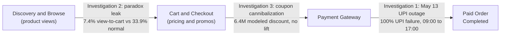

# Ecommerce Revenue Investigations: SQL Root-Cause Analysis

Three SQL investigations on one ecommerce dataset (PostgreSQL schema `ecom`, 40,000 orders, March 16 to June 14, 2026). Each one starts from a business anomaly and ends with a quantified cause and a recommended action.

## Scorecard

| Investigation | Business anomaly | Root cause | Quantified impact | Recommended action |
| --- | --- | --- | --- | --- |
| [01. Revenue cliff](01_revenue_cliff/revenue_cliff_investigation.md) | **-63%** paid revenue on May 13 (paid orders -55%) | 8-hour UPI `GATEWAY_TIMEOUT` across all gateways | 157 failed orders (about 1.01M), 66 customers not recovered in 7 days | UPI fallback routing and hourly payment-health alerts |
| [02. Paradox products](02_high_views_low_conversion/.md) | **26%** of views convert to only **3%** of units | Low view-to-cart (7.4% vs 33.9%), pointing to the product page | 154 products, worst: Velvet Kajal at 71x | Product-page and social-proof audit on the highest-view products |
| [03. Coupon cannibalization](03_coupon_cannibalization/INVESTIGATION.md) | **No basket lift** despite 22% of orders using a coupon | Untargeted discounts, 78% of intro-code use by repeat buyers | 6.4M modeled discount (79% to existing buyers) | Enforce first-order-only codes and run a randomized holdout |

## Where each problem sits in the customer journey



## Findings at a glance

### 01. The May 13 cliff: every UPI payment failed for 8 hours

```
Hour of day (May 13)   00 ... 08 | 09  10  11  12  13  14  15  16 | 17 ... 23
UPI status             normal    | ALL UPI PAYMENTS FAILED        | recovered
                       ✅✅✅✅✅ | ❌  ❌  ❌  ❌  ❌  ❌  ❌  ❌ | ✅✅✅✅✅

Failed UPI payments per hour (normal day: 0-1 per hour)
09:00  ███████████████                15
10:00  █████████████████████          21
11:00  ███████████████                15
12:00  ███████████                    11
13:00  ███████████████████████        23
14:00  ███████████████████████████    27
15:00  █████████████████████████████  29
16:00  ██████████████████████████████ 30
```

- 171 of 171 UPI payments in the window failed, on all four gateways. 168 were gateway timeouts.
- Only 47% of orders were paid that day, against 93-97% on every other day.
- The dashboard showed -23% because it counted failed orders as revenue.

### 02. The paradox: shoppers look but do not add to cart

```
View-to-cart rate
Normal products:        [██████████████████████████████████] 33.9%
3-5x paradox products:  [████████████                       ] 11.7%
5x+ paradox products:   [███████                            ]  7.4%   <- biggest leak
```

- 154 products take about 26% of all views but only about 3% of paid units.
- Price, stock, traffic source, device, returns and reviews (about 4.1 stars) all look normal. By elimination, the product page is the likeliest cause.

### 03. Coupons: a large discount, no measurable lift

```
Average order value, no coupon:          6,335
Average order value, with coupon:        6,334   (-1, no lift)
Same customers, coupon vs no coupon:    +112     (+1.8%) against a 756 average discount
Modeled discount cost:                   6.4M    (2.7% of paid order value)
Intro codes used by repeat buyers:       78%     (382 of 490 redemptions)
Share of discount going to existing buyers: 79%
```

- Coupon share of orders is flat at about 22% in every week and every segment, so coupons are not targeted.
- Percent and BOGO coupons cost about 17% of the order for a basket lift of 1% or less.

## How the three connect

| | Revenue cliff | Paradox | Coupons |
| --- | --- | --- | --- |
| Where in the funnel | Checkout to payment | View to add-to-cart | Price at purchase |
| Time pattern | One day, 8 hours | Every day | Every day |
| Type of loss | Lost sales | Lost sales | Given-away margin |
| Cause found | Yes: UPI timeouts | Partly: product page suspected | Partly: untargeted discounts |

- **Separate problems.** The paradox products held 26.1% of views on May 13 and coupons were 22.7% of orders, both normal, so neither caused the cliff.
- **One theme.** In each case a headline number hid the mechanism: revenue counted failed orders, views counted browsers rather than buyers, and coupon orders counted discounted sales as growth.
- **Shared fixes.** Define revenue as paid orders, record the discount on every order, add product cost so margin can be measured, and track each funnel step as its own metric.

## Repository layout

```
01_revenue_cliff/                 INVESTIGATION.md, revenue_cliff_queries.sql (Q1-Q18)
02_high_views_low_conversion/     INVESTIGATION.md, high_views_low_conversion_queries.sql (P1-P9)
03_coupon_cannibalization/        INVESTIGATION.md, coupon_cannibalization_queries.sql (C1-C11)
```

## Skills shown

- SQL: CTEs, window functions (`ROW_NUMBER`, `LAG`), conditional aggregation (`FILTER`), cohort and funnel analysis, time-windowed joins.
- Analysis: hypothesis testing, root-cause elimination, sizing impact, separating correlation from incrementality.
- Data judgment: spotting reporting artifacts, flagging data-quality gaps and stating limits.

## Conventions and caveats

- **Paid** means `orders.payment_status = 'paid'`. Timestamps are used as stored, with no time-zone conversion, so all times are as recorded in the data.
- Amounts are in the dataset's currency units (mostly INR). About 8% of orders use the USD price list, so totals may mix currencies.
- Queries are written in PostgreSQL syntax and validated in DuckDB against the CSV exports.
- `orders.discount` is 0 on every row, so coupon cost is **modeled** from the coupon table (rules are in the SQL header). Without product cost, margin impact is expressed as a share of revenue.
- Investigations 2 and 3 have no experiment behind them, so their conclusions come from comparing behaviour, not from measured lift. A holdout test is the recommended next step.
- Other known gaps: coupon names do not match their discount types, and 32 reviews are attached to failed orders.
